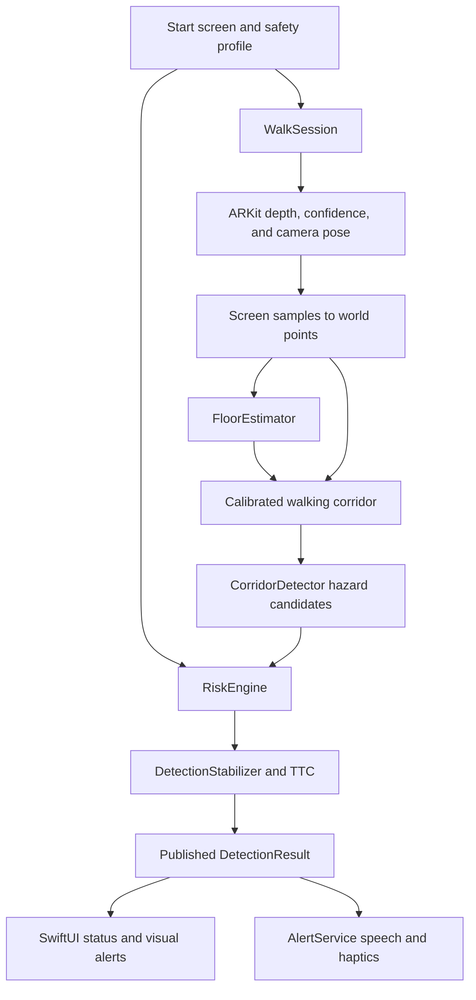

# PathGuard — Implementation and Technical Summary

PathGuard is a native iPhone/iPad walking-assistance prototype. It uses the rear camera, ARKit scene depth, and device pose to estimate obstacles and changes in ground height inside a walking corridor. A selected safety profile personalizes warning distances, hazard selection, vibration intensity, speech, and visual alerts.

The displayed product name is **PathGuard**. The repository, Xcode target, bundle identifier, and `SafeStepApp` entry-point type retain the original SafeStep naming. This document describes the current source implementation rather than a proposed architecture.

## Technology stack

| Technology | Role in this app |
| --- | --- |
| Swift | Application logic, value-type models, geometry, filtering, and tests. The project uses Swift 5 language mode. |
| SwiftUI | Start screen, profile selection, Custom settings sheet, live status, navigation, and diagnostics. |
| ObservableObject / @Published | `WalkSession` publishes session and detection state for reactive UI updates. These observation APIs belong to Combine and are available through SwiftUI imports. |
| ARKit | `ARSession`, gravity-aligned world tracking, camera pose/intrinsics, tracking status, and `ARFrame.sceneDepth`. |
| SceneKit-backed ARSCNView | Camera preview sharing the same AR session as detection. Embedded in SwiftUI through `UIViewRepresentable`; no virtual scene content is required by the current app. |
| Core Video APIs | Read-only access to depth and confidence `CVPixelBuffer` memory, including row strides. |
| SIMD / simd | 3D vectors, matrices, dot/cross products, quaternion orientation smoothing, and coordinate transformations. |
| AVFoundation | Camera permission, text-to-speech through `AVSpeechSynthesizer`, and audio-session configuration. |
| Core Haptics | Custom repeated vibration patterns through `CHHapticEngine` and cached pattern players. |
| UIKit | Camera-view integration, idle-timer management, and impact feedback when Core Haptics playback throws an error on supported hardware. |
| Foundation | Timers, dates, numeric formatting, collections, and supporting model utilities. |
| Xcode asset catalogs and Info.plist | Separate start-screen artwork and app icon, app display name, permissions, supported orientations, and application metadata. |

The deployment target is iOS 17.0. Live scanning checks `ARWorldTrackingConfiguration.supportsFrameSemantics(.sceneDepth)` at runtime and requires compatible LiDAR hardware. The current source uses Apple system frameworks; it does not include a third-party inference library, a trained object-detection model, a backend, or a database.

## Architecture and source organization

The app separates SwiftUI presentation, session coordination, numerical detection, risk evaluation, and feedback. This is similar to an MVVM arrangement: views observe `WalkSession`, while most detection calculations live in plain Swift structures and functions.

| File or directory | Main responsibility |
| --- | --- |
| `SafeStepApp.swift` | `@main` application entry point; opens `StartView` in a `WindowGroup`. |
| `StartView.swift` | Shared colors, branding, pre-walk profile picker, start navigation, and `CustomProfileSettings`. |
| `LiveDetectionView.swift` | Owns `WalkSession` using `@StateObject`; renders preview, warnings, controls, and lifecycle bindings. |
| `DebugPanel.swift` | Floor calibration details, coverage, movement, closing speed, TTC, and manual warning tests. |
| `Services/WalkSession.swift` | AR session lifecycle, permission handling, frame decoding, movement estimation, floor calibration, and pipeline orchestration. Also defines `CameraPreview`. |
| `Detection/DepthProcessing.swift` | Depth projection, corridor geometry, floor estimation, hazard candidates, and earlier coarse-grid utilities. |
| `Models/RiskAssessment.swift` | Detection configuration, safety profiles, hazards, risk arbitration, warning stages, and temporal stabilization. |
| `Services/AlertService.swift` | Speech and haptic generation, repeat timing, urgent escalation, and cancellation. |
| `Assets.xcassets` | `BrandLogo.imageset` for the start screen and `AppIcon.appiconset` for the home-screen icon. |
| `Tests/DetectionTests.swift` | Standalone executable checks for geometry, calibration, profiles, arbitration, and temporal behavior. |



## Session startup and frame processing

Before starting, the user selects a profile. The live view initializes a `WalkSession` with that profile, and its `onAppear` starts scanning. The session checks hardware support and camera permission before running `ARWorldTrackingConfiguration` with `.sceneDepth` and `.gravity` alignment.

AR session callbacks run on the main queue. Frames are processed no more frequently than once every 0.1 seconds, giving a nominal maximum detection rate of 10 Hz. Rendering uses the AR view independently; the 10 Hz limit applies to the app's detection processing.

Each processed frame performs these steps:

1. Require normal ARKit tracking and update the last-received-frame timestamp.
2. Estimate device translation, horizontal velocity, speed, orientation, and heading.
3. Check camera pitch and alignment with the walking direction.
4. Decode depth observations once for both calibration and detection.
5. Establish a floor reference, or report why calibration is not ready.
6. Convert observations into the floor-relative walking corridor.
7. Detect supported obstacle and drop candidates and choose a target hazard.
8. Stabilize distance/stage and estimate time to collision when measurements are consistent.
9. Publish the result and coverage state for UI and feedback.

A separate 0.15-second heartbeat drives alert repeats and invalidates stale readings after 1.5 seconds without an accepted frame. This timer does not create new depth measurements.

## Depth sampling and coordinate conversion

`depthObservations` samples a **48 × 72** grid of screen locations, up to 3,456 observations per processed frame. It uses the inverse of ARKit's portrait display transform to map the displayed camera crop back into sensor coordinates.

The implementation locks the depth buffer read-only and reads Float32 depth in meters using the actual bytes per row. If a confidence map is available, values below 1 are rejected. Nonfinite and nonpositive depth values never become 3D points. Invalid observations retain their rays so they still count toward expected corridor coverage.

For sensor pixel `(u, v)` and camera intrinsics `(fx, fy, cx, cy)`, the camera ray is:

```text
cameraRay = ((u - cx) / fx, -(v - cy) / fy, -1, 0)
worldRay  = cameraTransform × cameraRay
worldPoint = cameraPosition + worldRay.xyz × depth
```

The ray is intentionally **not normalized**: the supplied depth is treated as axial camera depth. A normalized ray would change the reconstructed geometry away from the optical axis.

World points are then transformed into corridor coordinates:

```text
x = dot(worldPoint - cameraPosition, right)
y = worldPoint.y - calibratedFloorY
z = dot(worldPoint - cameraPosition, walkingHeading)
```

Here, `x` is lateral displacement, `y` is height above the floor, and `z` is forward distance. Reported hazard distance is primarily forward corridor distance, not a general Euclidean range to an object.

## Movement and orientation estimation

Movement comes from changes in ARKit camera position; the app does not directly create a Core Motion manager. Horizontal velocity is smoothed with 65% previous velocity and 35% new velocity. Full 3D speed is also checked during calibration so raising or lowering the phone counts as movement.

| Movement state | Estimated horizontal speed | Distance offset |
| --- | --- | --- |
| Stationary | Below 0.15 m/s | −0.2 m for early/warning stages |
| Walking | 0.15 to below 1.6 m/s | 0 m |
| Moving quickly | At least 1.6 m/s | +0.6 m |

Quaternions are smoothed with spherical interpolation and a 0.2-second time constant. While moving, the corridor follows estimated horizontal velocity; while stationary, it follows camera heading. If movement and camera heading have a dot product below 0.5, scanning guidance asks the user to point the camera in the walking direction.

## Floor calibration

`FloorEstimator` establishes a horizontal floor in gravity-aligned world coordinates. It searches height clusters instead of fitting arbitrary planes or relying on ARKit plane anchors.

Calibration requires:

| Condition | Default |
| --- | --- |
| Downward camera pitch | 45°–70° inclusive |
| Device speed | Below 0.08 m/s |
| Angular speed | At most 10°/s |
| Stable observation period | About 1 second, with at least five accepted estimates |
| Candidate forward distance | 0.3–2.0 m |
| Candidate lateral extent | Within 0.8 m of the centerline |
| Camera height above candidate floor | 0.5–2.2 m |
| Height-fit tolerance | 0.035 m |
| Minimum supporting samples | 40 and at least 40% of candidates |
| Robust spatial extent | At least 0.4 m wide and 0.5 m long |
| Spatial occupancy | At least eight 0.2 m grid cells |

Height bins and neighboring bins produce candidate fits. Median heights and inlier tests reject scattered points. Spatial extent and occupied-cell requirements help reject a small repeated patch. Competing floor levels are considered ambiguous when a second sufficiently separated fit has at least 75% of the strongest fit's support.

Motion, unsuitable pitch, inconsistent height, or a sample gap above 0.35 seconds clears the pending calibration interval. Once calibrated, floor height is frozen until recalibration or lifecycle reset. This prevents a lower landing from silently becoming the new floor while approaching it.

The displayed phone height is `cameraPosition.y - floorY`, a vertical height rather than a slanted camera-to-floor distance.

## Corridor and hazard detection

`CorridorGeometry` defines a physical box around the estimated walking path:

- Half-width: 0.45 m, for a total width of 0.9 m.
- Near boundary: 0.05 m forward.
- Vertical extent: 1 m below the floor to 0.3 m above the camera.
- Search distance: `max(3, 3 × profileMultiplier) + 0.6 + 0.2` meters under default settings.

Ray-box intersection selects screen samples expected to observe the corridor. The detector requires at least 55% valid depth coverage and at least five points within the corridor.

Points are categorized relative to the calibrated floor:

| Candidate type | Rule |
| --- | --- |
| Ground | Absolute height at most 0.12 m |
| Obstacle | More than 0.18 m above the floor |
| Lower ground | More than 0.18 m below the floor |

An obstacle or lower-surface candidate requires at least five samples within a 0.25 m forward-depth span. The nearest qualifying cluster is used. This avoids allowing one isolated return to trigger a hazard and helps preserve a small close object when many samples observe a farther wall.

For a drop, the detector additionally requires near ground before the lower surface. Its edge-distance estimate uses supported ground preceding that surface, excluding ground beyond the drop. Without supporting ground, a lower surface alone cannot establish a valid drop reading.

The current detector produces obstacle, too-close, and possible-drop observations. The model supports a distinct `stairs` hazard, but there is no separate stair-geometry classifier. Descending stairs remain grouped under “Possible drop-off / stairs down”; raised stair surfaces may be treated as obstacles.

A clear risk assessment is not enough to display “Path clear.” Observed ground reach must also satisfy:

```text
observedGroundDistance >= 3 × profileMultiplier + movementOffset - 0.15
```

Otherwise the live view reports limited/near-range scanning. Nearby hazards can still produce warnings when far coverage is insufficient.

## Safety profiles and customization

`SafetyProfile` is an `Equatable` value type. The selected profile is passed into the session, detector, risk engine, and alert service.

| Setting | Vision Impaired | Mobility Impaired | General / Distracted | Custom default |
| --- | --- | --- | --- | --- |
| Distance multiplier | 1.5× | 1.5× | 1.0× | 1.0× |
| Obstacle priority | 5 | 3 | 3 | 3 |
| Stairs priority | 5 | 5 | 3 | 3 |
| Drop-off priority | 5 | 5 | 3 | 3 |
| Too-close priority | 5 | 5 | 5 | 5 |
| Haptics | Strong | Strong | Medium | Medium |
| Voice | All warning stages | All warning stages | Critical only | Critical only |
| Visual alerts | Off | On | On | On |
| Repeat interval | 1.6 s | 1.6 s | 2.5 s | 2.5 s |

Custom settings use SwiftUI bindings, a slider, steppers, pickers, and toggles. Allowed values are 0.5–2.0× distance, priorities 1–5, and repeat intervals 1–10 seconds. The UI uses 0.1× distance steps and 0.5-second repeat steps. Model mutation also clamps these values; nonfinite multipliers and repeat intervals fall back to defaults.

Despite the property name `repeatFrequency`, its unit is **seconds between repeats**, not hertz. Lower values mean more frequent alerts. Too-close arbitration remains absolute regardless of its editable numeric priority.

Custom values live in `StartView` state and survive navigation back to that existing view. They are not written to UserDefaults, SwiftData, a file, or cloud storage. An active session retains the profile supplied at initialization; Voice and Touch can also be toggled locally during the walk.

## Risk engine and scoring

`RiskEngine.assess` accepts either one `(hazard, distance)` pair or multiple `HazardObservation` values, together with `Movement` and `SafetyProfile`. It returns a `RiskAssessment`.

| Hazard | Base distance |
| --- | --- |
| Obstacle | 1.5 m |
| Stairs | 2.0 m |
| Drop-off | 2.0 m |
| Too close | 0.8 m |

Let `T = baseDistance × warningDistanceMultiplier`. The returned `personalizedDistanceThreshold` is exactly `T`; movement offsets are applied separately to stage boundaries:

```text
early boundary     = 1.5 × T + movementOffset
warning boundary   = T + movementOffset
immediate boundary = 0.6 × T + max(0, movementOffset)
```

Stages are evaluated from immediate to early. Immediate/warning distance comparisons are strict `<`; early includes equality. A valid too-close observation always evaluates as immediate. The corridor detector labels an obstacle too-close when its distance is at most `0.8 × multiplier`.

For example, a walking General user has an obstacle threshold of 1.5 m and early boundary of 2.25 m. A walking Vision user has an obstacle threshold of 2.25 m and early boundary of 3.375 m.

Multiple observations are filtered for finite, nonnegative distance and active stages, then ordered by:

1. Too-close status, with absolute priority.
2. Warning stage: immediate, warning, then early.
3. Profile priority, highest first.
4. Distance, nearest first.
5. Hazard name for a deterministic final tie break.

The engine returns the selected target, not a sum across all hazards. Arbitration occurs before temporal TTC estimation in the live pipeline; TTC later refines the selected assessment.

`RiskAssessment` exposes `targetHazard`, `distance`, `movement`, `personalizedDistanceThreshold`, `stage`, `level`, `totalRiskScore`, optional closing speed/TTC, and advice. Stage maps to risk level as follows: clear → low, early/warning → medium, immediate → high.

The score is a bounded heuristic:

```text
clear score     = 0
too-close score = 100
otherwise:
    stageBase = 15 for early, 45 for warning, 75 for immediate
    proximity = clamp(1 - distance / max(0.01, T), 0, 1)
    score = min(99, stageBase + 3 × profilePriority + 9 × proximity)
```

Risk level comes from stage, not score cutoffs. The score is available to callers but is not currently displayed by the main live screen. It is not a collision probability.

The older `DetectionConfiguration.threshold` helper and generic distance/cooldown fields remain in the model file. Current personalized stages use `RiskAssessment.threshold`, and normal alert repeat timing uses the profile interval.

## Temporal stabilization and time to collision

`DetectionStabilizer` reduces jitter while allowing a newly closer reading to take effect immediately. For continuous observations, retreating distances move only 35% toward the new value; approaching distances use the new distance directly.

Closing speed is estimated from four successive distance-rate samples. It requires stable heading, compatible hazard identity, supporting positions within 0.15 m laterally and vertically, gaps no greater than 0.35 seconds, rate magnitude at most 4 m/s, and deviations below 0.5 m/s from the mean. The obstacle/too-close transition can count as the same surface.

When reliable closing speed is at least 0.2 m/s:

```text
TTC = distance / closingSpeed
```

TTC below 3, 2, or 1 seconds can trigger early, warning, or immediate stages respectively. Turns, changed support, noisy rates, and gaps discard unreliable closing-speed estimates.

A decreasing warning stage is held until the reading remains safely beyond the previous boundary for 0.6 seconds, with a 0.2 m distance margin and, when TTC exists, a 0.3-second TTC margin. `heldStage` records this temporary hold. Explicit data invalidation resets the stabilizer rather than continuing an old warning indefinitely.

## Haptic and spoken feedback

`AlertService` receives the stabilized assessment through the heartbeat. Low risk silences current output. Medium and high risk use the profile's repeat interval, with exceptions for urgent escalation and changed spoken hazards.

| Pattern | Medium | High |
| --- | --- | --- |
| Continuous pulses | 2 | 3 |
| Pulse duration | 0.22 s | 0.30 s |
| Gap | 0.18 s | 0.12 s |
| Sharpness | 0.7 | 1.0 |

Haptic intensity is 0.35, 0.65, or 1.0 for light, medium, or strong. Players are cached per risk level for the session's fixed profile. Engine resets clear the cache. Playback errors schedule UIKit impact pulses; devices reporting no Core Haptics support return before playback rather than receiving this error fallback.

Urgent haptic escalation can bypass normal repeats after a 0.3-second minimum gap. Speech can bypass the repeat interval on escalation, or after two seconds when the spoken hazard changes.

Speech uses `AVSpeechSynthesizer`, an `en-US` voice, and rate 0.48. The audio session uses playback category, voice-prompt mode, and ducking of other audio. Immediate warnings announce the hazard and ask the user to stop; other spoken warnings include stage, distance, and advice. General speaks only at high risk, while Vision and Mobility also speak medium warnings.

Manual diagnostic tests deliberately play feedback regardless of Voice/Touch toggles. They defer ordinary live feedback for two seconds; a real high-risk warning can preempt the test. Stopping or leaving diagnostics cancels test output.

## UI, branding, and lifecycle

The start screen uses `NavigationStack` and a scrollable layout. A menu picker selects the profile, and Custom opens a settings sheet. The live view includes an AR preview, corridor sampling overlay, warning card, measurements, Voice/Touch toggles, a diagnostics sheet, and Pause/Resume controls.

Visual hazard cards, measurements, and the colored sampling overlay respect the visual-alert setting. Session guidance remains available. The UI includes accessibility labels and combined warning-card content, but full VoiceOver usability and accessibility validation are not established by the current tests.

`BrandLogo` contains the start-screen wordmark. `AppIcon` is a separate 1024 × 1024 opaque PNG containing the compact symbol on sage. Both Xcode projects select the AppIcon catalog. `CFBundleDisplayName` is PathGuard; internal target naming does not determine the label beneath the home-screen icon.

`WalkSession` distinguishes user intent (`isEnabled`) from actual execution (`isRunning`). Going inactive pauses the AR session, stops alerts, clears results, and resets calibration. Returning active resumes an enabled walk with fresh calibration; a manually paused walk remains paused. Camera interruptions have separate delegate handling, and fatal session errors stop the walk.

Camera-permission callbacks carry a generation value so a late permission response cannot restart a cancelled session. The app disables the screen idle timer while scanning and restores it when suspended. Detection does not operate behind other apps or while the phone is locked.

## Data handling and performance characteristics

Depth and camera-pose processing happen on device. The current application has no network client, account system, analytics integration, frame recording/export path, or persistent walk history. Camera permission text states that frames are processed on the device.

The implementation limits work through frame throttling, a fixed sample grid, shared decoding for calibration/detection, local corridor filtering, and cached haptic players. Numerical processing currently runs on the main queue; there is no dedicated processing actor, background worker, Metal compute pipeline, or custom GPU kernel. Runtime latency, thermal behavior, and battery consumption require measurement on actual hardware.

## Validation and current limits

The standalone test executable uses `@main`, `precondition`, and a check counter rather than XCTest. The last successful run in this workspace passed **151 checks**, covering profiles and bounds, thresholds, arbitration, calibration conditions, ambiguous floors, projected camera rays, corridor coverage, obstacles/drops, TTC, smoothing, and release behavior. Swift syntax and plist/project configuration checks have also passed. These are not a substitute for a complete iOS build or device tests.

Run the numerical checks with a compatible Swift compiler and macOS SDK:

```sh
swiftc Detection/DepthProcessing.swift Models/RiskAssessment.swift Tests/DetectionTests.swift -o /tmp/safestep-tests
/tmp/safestep-tests
```

If the default SDK does not match the installed compiler, pass an appropriate `-sdk` path. The prior successful run used `/Library/Developer/CommandLineTools/SDKs/MacOSX26.5.sdk` and a writable module cache.

Full iOS compilation, live floor accuracy, physical haptic strength, speech intelligibility, and end-to-end response time remain unverified in this workspace. Important implementation limits include the following:

- Hazard recognition is geometric and does not identify semantic object classes or separate stair structures.
- Horizontal floor fitting can confuse a broad table or landing with the floor; slopes and floor changes require care and recalibration.
- The 0.18 m obstacle cutoff can miss lower trip hazards.
- Thin objects, glass, reflective surfaces, tracking drift, and missing depth can cause missed or incorrect readings.
- A longer configured search distance does not guarantee that the sensor or camera view observes that distance.
- Profiles and thresholds are prototype heuristics, not validated stopping distances or medically personalized settings.
- There is no GPS navigation, route planning, persistent settings store, or background scanning implementation.

The core implemented capability is a foreground, floor-referenced depth pipeline with profile-aware risk selection and multimodal feedback. Further development can build on the existing numerical test boundary while adding measured device validation, persistent preferences, richer accessibility support, and a dedicated stair classifier.
